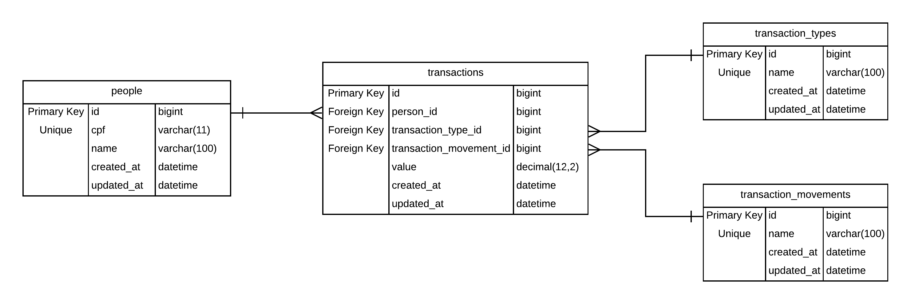

# CONTROLE FINANCEIRO - API
<br>

#### Introdução

O software “Controle Financeiro” foi desenvolvido com a linguagem de programação PHP, utilizando o framework Laravel 7 e  conceitos de API Rest. Este software consiste em uma API que possibilita o controle do saldo relacionado aos CPF cadastrados. Para tanto as seguintes funções estão disponíveis:

- Cadastro de pessoa;
- Saldo;
- Extrato;
- Crédito;
- Débito;
- Transferência.


#### Requisitos 
Para que seja possível executar o software em uma máquina linux é necessário que os seguintes pacotes estejam instalados e configurados:
- Apache
- PHP^7
- MySQL, MariaDB ou outro SGBD
- Git

#### Passos para a instalação 
		
1. Execute o comando a seguir no diretório "/data/www", para clonar o projeto
```
    git clone https://github.com/WelligtomGAlmeida/controle-financeiro.git
```

2. Execute os seguintes comandos na raiz do projeto para baixar as dependencias do projeto
```
    php composer.phar install
```	

3. Execute os seguintes comandos no diretório "/data/www" para mudar o apontamento da pasta default para a pasta public da aplicação:
```
    mv default/ default_backup
    ln -s controle-financeiro/public default
```	

4. Garanta que o usuário "apache" tenha acesso a toda os diretórios e arquivos da aplicação
	
5. Crie a Base de dados no seu SGBD
```
    create database controle_financeiro
```	

6. Configure o Banco de dados na aplicação. Para tal tarefa, abra em um editor de texto o arquivo ".env" que se encontra na raiz da aplicação. Neste arquivo você encontrará as seguintes linhas:
```
    DB_CONNECTION=mysql
    DB_HOST=127.0.0.1
    DB_PORT=3306
    DB_DATABASE=laravel
    DB_USERNAME=root
    DB_PASSWORD=
```
- Em DB_CONNECTION informe o SGBD que será utilizado (mysql, sqlite, sqlsrv ou pgsql)
- Em DB_HOST informe o IP do servidor de banco de dados, ou utilize 127.0.0.1 caso o banco esteja no mesmo servidor da aplicação.
- Em DB_PORT informe a porta de acesso ao banco de dados do servidor de banco de dados.
- Em DB_DATABASE informe o nome da Base de Dados criada anteriormente.
- Em DB_USERNAME informe o nome do usuário do Banco de Dados.
- Em DB_PASSWORD informe a senha de acesso do usuário do Banco de Dados.

4. Abra a linha de comando no diretório raiz da aplicação e execute o seguinte comando:
```
    php artisan migrate
```
	
5. Abra a linha de comando no diretório raiz da aplicação e execute o seguinte comando:
```
    php artisan db:seed
```

#### Banco de dados


